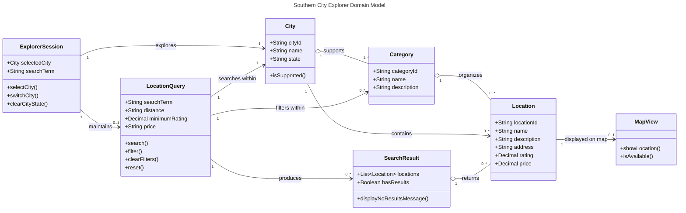

# IAP M3 — Domain Model and AI Critique
## What to do
### 1. Ask an AI tool to draft a domain model from your M2 requirements. Save that first draft before touching it.
   Link: https://claude.ai/share/95f10010-872b-4bef-b175-3e973695fc86

### 2. Produce your own domain model — a class diagram or an ER diagram, whichever fits your app.

   
### 3. Write a critique of the AI’s first draft against yours: where it over-modelled, where it under-modelled, where it guessed a relationship it had no basis for, and where it was right.
   
   My model keeps only the persisted entities (`City`, `Category`, `Location`) plus a small amount of transient session state, while the AI also pulls in LocationQuery, `SearchResult`, and `MapView` so that every user story has a visible home in the diagram. The AI version is stronger on traceability, on folding search and filters into a single query object, and on letting `City` support its own categories, which I had assumed to be a global list. But it mixes domain, application, and presentation layers, and it duplicates state: searchTerm and the city each live in two places, `City` reaches `Location` by two paths, and `MapView.isAvailable()` repeats the rule already on `Location.hasCoordinates()`. It also has some cardinality and type slips, such as the session-to-city link being `1` when it should be `0..1`, `price` typed as both `Decimal` and `String`, and no nullability marked. My model is cleaner on layers and persistence but leaves out search results and the map, so the best version would merge them by keeping your `LocationQuery` and city-scoped categories, dropping `MapView` and `SearchResult`, and removing the duplicated fields.
